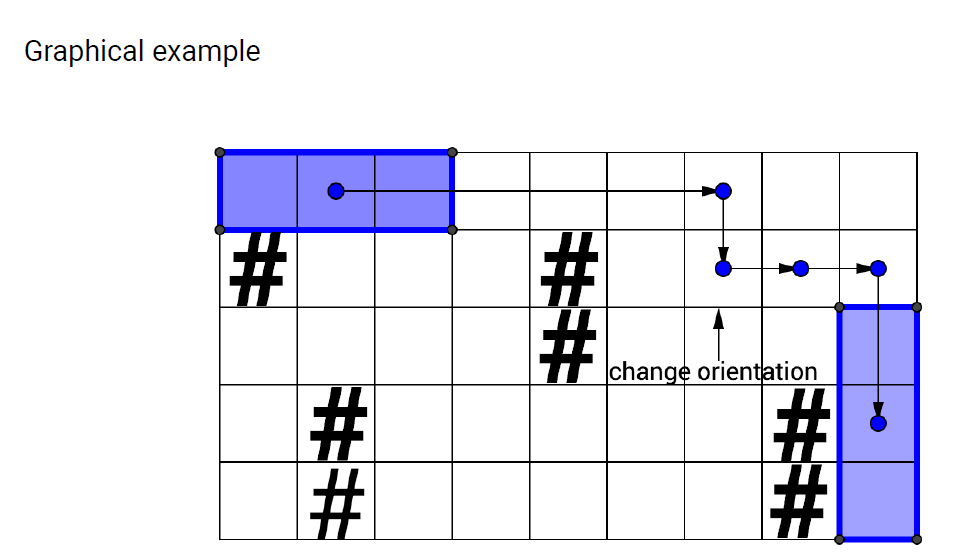

# Labyrinth
The goal is to carry the rod from the top left corner of the labyrinth to the bottom
right corner. This rod is not exactly the lightest thing you can imagine, so the
participant would naturally want to do it as fast as possible.

Find the minimal number of moves required to carry the rod through the labyrinth.
The labyrinth can be represented as a rectangular matrix, some cells of which are
marked as blocked, and the rod can be represented as a 1 × 3 rectangle. The rod
can't collide with the blocked cells or the walls, so it's impossible to move it into a
position in which one of its cells coincides with the blocked cell or the wall. The goal
is thus to move the rod into position in which one of its cells is in the bottom right
cell of the labyrinth.

There are 5 types of moves that the participant can perform: move the rod one cell
down or up, to the right or to the left, or to change its orientation from vertical to
horizontal and vice versa. The rod can only be rotated about its center, and only if the
3 × 3 area surrounding it is clear from the obstacles or the walls.
The rod is initially positioned horizontally, and its left cell lies in [0, 0].

**Guaranteed constraints**: 3 ≤ labyrinth.length ≤ 1000, 3 ≤ labyrinth[i].length ≤ 1000

Example:

